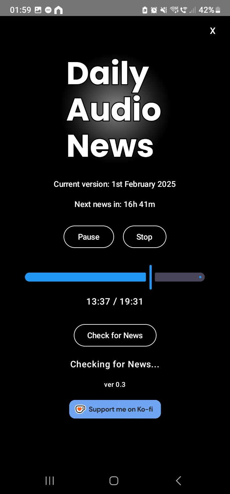

# Daily Audio News

Daily Audio News is an Android application that delivers daily audio news updates. The app features a simple, intuitive interface for playing and managing your daily news content.

## Features

- 📰 Daily audio news updates
- 🔄 Automatic update checking and download management
- ⏯️ Full media playback controls (play, pause, stop)
- 🎚️ Progress bar with seek functionality
- ⏰ Countdown timer to next news update
- 📱 Background playback support
- 🔒 Secure HTTPS file downloads
- 💾 Efficient local file caching

## Technical Details

- Built with modern Android development tools and practices:
  - Kotlin
  - Jetpack Compose for UI
  - ExoPlayer for media playback
  - Coil for image loading
  - Coroutines for asynchronous operations
  - StateFlow for reactive state management

## Installation

1. Download the latest APK from the [Releases](../../releases) page (or compile from the source)
2. Enable installation from unknown sources in your Android settings
3. Install the APK on your Android device

## Usage

1. Launch the app
2. The app will automatically check for the latest news update
3. Use the playback controls to manage audio playback
4. Click "Check for News" to manually check for updates
5. The countdown timer shows when the next news update will be available

## Support

If you find this app useful, you can support the development by:
- Contributing to the codebase
- Reporting issues
- Supporting through Ko-fi

## Version

Current version: 0.3

